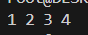

# Лабораторная работа 7. Знакомство с POSIX потоками
## Цель работы
Изучение базовых возможностей работы с потоками в POSIX (pthread): создание, ожидание, передача параметров, отмена и обработка завершения.  
**Требование:** Создать поток с помощью `pthread_create()`. Родительский и дочерний потоки выводят по 5 строк текста.  
## Задание 1: Создание потока
```c
#include <stdio.h>
#include <pthread.h>

void* child_thread(void* arg) {
    for (int i = 1; i <= 5; i++) {
        printf("Дочерний поток: строка %d\n", i);
    }
    return NULL;
}

int main() {
    pthread_t thread;
    pthread_create(&thread, NULL, child_thread, NULL);    
    for (int i = 1; i <= 5; i++) {
        printf("Родительский поток: строка %d\n", i);
    }    
    pthread_join(thread, NULL);
    return 0;
}
```
**Результат:**
Вывод перемешанных строк от родительского и дочернего потоков.  
  


## Задание 2: Ожидание потока
**Требование:** Родительский поток выводит текст после завершения дочернего.  
**Изменения:** Добавлен `pthread_join()` перед выводом в основном потоке.  
```c
#include <stdio.h>
#include <pthread.h>

void* child_thread(void* arg) {
    for (int i = 1; i <= 5; i++) {
        printf("Дочерний поток: строка %d\n", i);
    }
    return NULL;
}

int main() {
    pthread_t thread;
    pthread_create(&thread, NULL, child_thread, NULL);   
    pthread_join(thread, NULL);    
    for (int i = 1; i <= 5; i++) {
        printf("Родительский поток: строка %d\n", i);
    }  
    return 0;
}
```
**Результат:**
Сначала выводятся все строки дочернего потока, затем — родительского.  


## Задание 3: Параметры потока
**Требование:** Создать 4 потока, передавая разные строки для вывода.
```c
#include <stdio.h>
#include <pthread.h>
#include <string.h>

void* thread_func(void* arg) {
    char* msg = (char*)arg;
    for (int i = 1; i <= 3; i++) {
        printf("%s: итерация %d\n", msg, i);
    }
    return NULL;
}

int main() {
    pthread_t threads[4];
    char* messages[] = {"Поток 1", "Поток 2", "Поток 3", "Поток 4"};   
    for (int i = 0; i < 4; i++) {
        pthread_create(&threads[i], NULL, thread_func, messages[i]);
    }  
    for (int i = 0; i < 4; i++) {
        pthread_join(threads[i], NULL);
    }  
    return 0;
}
```
**Результат:**
Каждый поток выводит свою строку в произвольном порядке.


## Задание 4: Завершение потока без ожидания
**Требование:** Прервать дочерние потоки через 2 секунды.
```c
#include <stdio.h>
#include <pthread.h>
#include <unistd.h>

void* child_thread(void* arg) {
    while (1) {
        printf("Дочерний поток работает...\n");
        sleep(1);
    }
    return NULL;
}

int main() {
    pthread_t thread;
    pthread_create(&thread, NULL, child_thread, NULL);    
    sleep(2);
    pthread_cancel(thread);
    printf("Основной поток: дочерний поток отменен\n"); 
    return 0;
}
```
**Результат:**
Дочерний поток прерывается через 2 секунды.


## Задание 5: Обработка завершения потока
**Требование:** Вывести сообщение перед завершением потока.
```c
#include <stdio.h>
#include <pthread.h>
#include <unistd.h>

void cleanup(void* arg) {
    printf("Очистка: ресурсы освобождены\n");
}

void* child_thread(void* arg) {
    pthread_cleanup_push(cleanup, NULL);
    while (1) {
        printf("Дочерний поток активен\n");
        sleep(1);
    }
    pthread_cleanup_pop(0);
    return NULL;
}

int main() {
    pthread_t thread;
    pthread_create(&thread, NULL, child_thread, NULL); 
    sleep(2);
    pthread_cancel(thread);
    pthread_join(thread, NULL);
    return 0;
}
```
**Результат:**
Перед завершением выводится сообщение `Очистка: ресурсы освобождены`


## Задание 6: Реализация Sleepsort
**Требование:** Реализовать алгоритм Sleepsort.
```c
#include <stdio.h>
#include <pthread.h>
#include <unistd.h>

void* sleep_sort(void* arg) {
    int value = *(int*)arg;
    sleep(value);
    printf("%d ", value);
    return NULL;
}

int main() {
    int numbers[] = {3, 1, 4, 2};
    pthread_t threads[4];
    for (int i = 0; i < 4; i++) {
        pthread_create(&threads[i], NULL, sleep_sort, &numbers[i]);
    }
    for (int i = 0; i < 4; i++) {
        pthread_join(threads[i], NULL);
    }
    printf("\n");
    return 0;
}
```
**Результат:**
Вывод отсортированного массива: `1 2 3 4`.



## Вывод 
В ходе работы изучены основы работы с потоками в POSIX: создание, передача параметров, ожидание, отмена и обработка завершения. Также реализован алгоритм Sleepsort.
